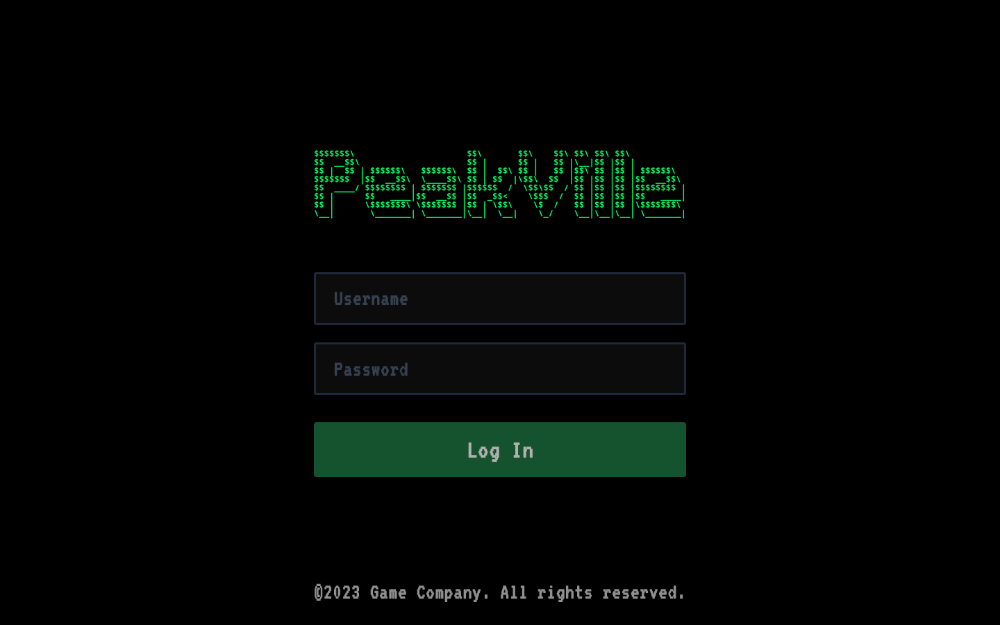
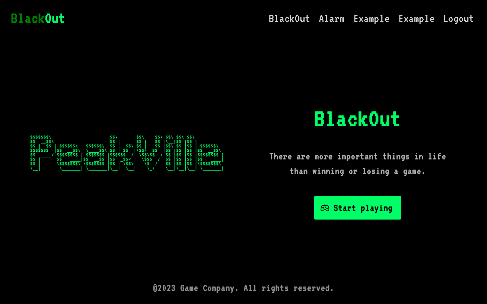

<div align="center">

# `peakville`

<h3>
  Retro-terminal web app 
</h3>

<!-- Badges -->


<!-- Demo image -->



</div>

<!-- TABLE OF CONTENTS -->
## Table of Contents

* [Develop ⚙️](#develop)
* [License 📑](#license)

## Develop ⚙️
- Clone the project:
```shell
clone https://github.com/nemo256/peakville
cd peakville
```

- Install the required dependencies:
```shell
yarn
```

- Change the code then launch a local server instance:
```shell
yarn dev
```

## License 📑
- Please read [peakville/LICENSE](https://github.com/nemo256/peakville/blob/master/LICENSE)
